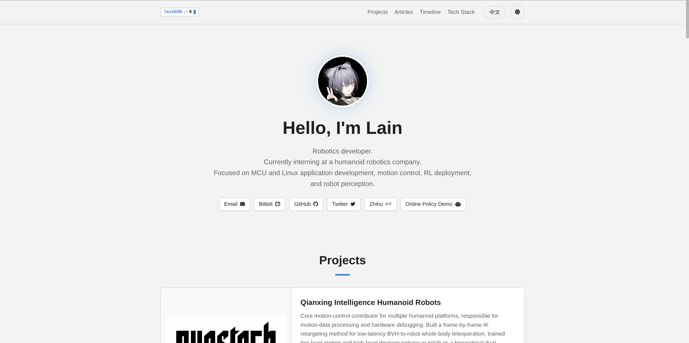
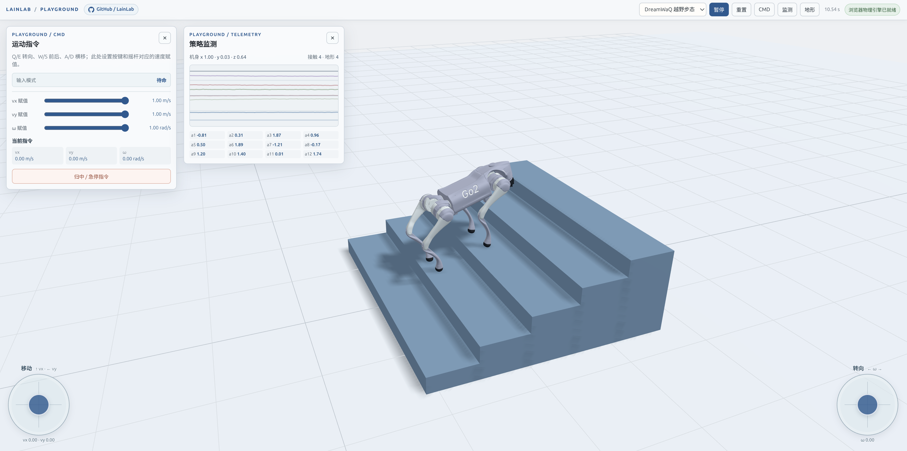

# 个人主页 / 开发者作品集网页模板

[English](README.md) | [中文](README_zh.md)

一个纯前端静态单页模板，适合用来做个人主页、作品集、技术名片或项目导航页。
无需后端、无需构建工具，下载后替换文案与图片即可使用。

> 仓库中的项目、经历、链接和图片均为示例内容，请在使用时替换为自己的信息。

## 预览

### 个人主页



### Playground



## 目录

- [预览](#预览)
- [模板特性](#模板特性)
- [技术栈](#技术栈)
- [快速开始](#快速开始)
- [目录结构](#目录结构)
- [核心功能与实现位置](#核心功能与实现位置)
- [自定义指南](#自定义指南)
- [部署上线](#部署上线)
- [Playground 子页面](#playground-子页面)
- [配置清单](#配置清单)
- [常见问题](#常见问题)

## 模板特性

- **纯静态单页**：仅包含 HTML、CSS、原生 JavaScript，不需要 Node.js、数据库或服务端。
- **数据驱动渲染**：项目、文章、时间线、技术栈、联系方式均在 `assets/js/main.js` 中以数组配置，便于统一维护。
- **多语言支持**：内置中英文语言包，通过 `lang/*.json` 与 `data-i18n` 属性切换页面文案，可继续扩展其他语言。
- **亮色 / 暗色主题**：基于 CSS 变量实现，支持一键切换，并使用 `localStorage` 记住用户选择。
- **响应式布局**：适配桌面端、平板与移动端，导航栏在窄屏下自动重排。
- **内容模块完整**：
  - 个人简介 / Hero
  - 项目卡片
  - 文章或文档列表
  - 时间线 / 经历
  - 技术栈
  - 联系方式与社交链接
  - 页脚
- **滚动进入动效**：使用 `IntersectionObserver` 实现内容渐入，并自动尊重系统“减少动态效果”设置。
- **平滑锚点导航**：点击导航链接平滑滚动到对应板块。
- **图标支持**：通过 Font Awesome CDN 引入社交、项目和技术栈图标。
- **可选 Playground**：仓库内附带一个预构建的机器人策略试玩页，可作为独立静态子页面使用；不需要时可直接删除。

## 技术栈

| 层级 | 使用技术 |
| --- | --- |
| 页面结构 | HTML5 |
| 样式 | CSS3、CSS 自定义属性、Flexbox、Grid、媒体查询 |
| 交互 | 原生 JavaScript（ES6+）、DOM API |
| 多语言 | Fetch API、JSON、`data-i18n` 属性 |
| 状态持久化 | `localStorage` |
| 动画与性能 | `IntersectionObserver`、`prefers-reduced-motion` |
| 图标 | Font Awesome CDN |
| 可选子页面 | 预构建静态资源、MuJoCo WASM、ONNX 策略文件 |

## 快速开始

### 1. 获取代码

```bash
git clone https://github.com/<your-username>/<your-repo>.git
cd <your-repo>
```

### 2. 本地预览

推荐使用任意静态文件服务器运行，不要直接双击 `index.html`。
因为语言包通过 `fetch` 加载 JSON，本地直接打开时可能受到浏览器安全策略限制。

```bash
# Python 3
python3 -m http.server 8080

# 或 Node.js
npx serve .
```

然后访问：

```text
http://localhost:8080
```

### 3. 开始自定义

建议按以下顺序修改：

1. 替换 `assets/images/` 中的头像与项目封面；
2. 修改 `lang/zh.json` 和 `lang/en.json` 中的文案；
3. 修改 `assets/js/main.js` 中的项目、文章、时间线、技术栈与联系方式数据；
4. 按需修改 `assets/css/style.css` 中的主题变量；
5. 更新 `index.html` 中的站点标题、描述和图标。

## 目录结构

```text
.
├── index.html                  # 单页入口
├── README.md                   # 英文说明
├── README_zh.md                # 中文说明
├── assets/
│   ├── css/
│   │   └── style.css           # 设计变量、主题、布局、组件、响应式
│   ├── js/
│   │   ├── i18n.js             # 语言加载、切换与文案替换
│   │   └── main.js             # 主题切换、内容渲染、滚动动效
│   └── images/                 # 头像、项目封面、网页截图等图片资源
├── lang/
│   ├── zh.json                 # 中文语言包
│   └── en.json                 # 英文语言包
└── playground/                 # 可选：预构建的机器人策略试玩页
    ├── index.html
    ├── assets/
    ├── policies/
    └── robot/
```

## 核心功能与实现位置

| 功能 | 主要文件 | 说明 |
| --- | --- | --- |
| 主题切换 | `index.html`、`assets/js/main.js`、`assets/css/style.css` | 页面加载时读取已保存主题；点击按钮在 `light` / `dark` 之间切换并写入 `localStorage`。 |
| 多语言切换 | `assets/js/i18n.js`、`lang/*.json` | 读取当前语言，通过 Fetch 加载对应 JSON；页面元素使用 `data-i18n` 标记文案键。 |
| 项目列表 | `assets/js/main.js` | `PROJECTS` 数组定义封面、标题键、描述键、标签和操作链接。 |
| 文章 / 文档 | `assets/js/main.js` | `DOCUMENTS` 数组定义文章卡片内容与链接。 |
| 时间线 | `assets/js/main.js` | `TIMELINE_EVENTS` 定义事件顺序，具体日期、标题、描述写入语言包。 |
| 技术栈 | `assets/js/main.js` | `TECH_STACK` 按分类配置技能项与图标。 |
| 联系方式 | `assets/js/main.js` | `CONTACT_LINKS` 定义邮箱、代码仓库、社交平台或站内子页面入口。 |
| 滚动动效 | `assets/js/main.js`、`assets/css/style.css` | 卡片、时间线和技能分组进入视口时渐入；系统开启“减少动态效果”时自动禁用。 |
| 响应式适配 | `assets/css/style.css` | 主要断点为 `768px` 与 `360px`。 |

## 自定义指南

### 1. 修改站点信息

编辑 `index.html`：

- `<title>`：浏览器标签页标题；
- `<meta name="description">`：搜索引擎与分享摘要；
- `<link rel="icon">`：站点图标；
- 导航栏 Logo 与锚点链接；
- 各板块的静态占位文案。

> 页面运行后，多语言文案会由 `assets/js/i18n.js` 覆盖，因此最终显示内容应优先以 `lang/*.json` 为准。

### 2. 修改头像与项目图片

将图片放入 `assets/images/`，然后：

- 替换头像时，保持 `index.html` 中的头像路径正确；
- 修改项目图片时，更新 `assets/js/main.js` 中 `PROJECTS` 每项的 `img` 字段；
- 图片建议使用统一的比例与合理的压缩体积，以提升加载速度。

### 3. 修改多语言文案

语言包位于：

```text
lang/zh.json
lang/en.json
```

常用文案键：

```text
nav.*                 导航
intro.*               个人简介区
projects.itemN.*      第 N 个项目
documents.itemN.*     第 N 篇文章 / 文档
timeline.eventN.*     第 N 个时间线事件
skills.*              技术栈分类
contact.*             联系方式
footer.*              页脚
```

新增语言时：

1. 在 `lang/` 下创建对应语言文件，例如 `lang/ja.json`；
2. 复制一份完整语言包结构并翻译；
3. 在 `assets/js/i18n.js` 中扩展语言切换逻辑。当前模板默认在中英文之间切换，如需多语言下拉框，可自行调整 `.lang-toggle` 的交互。

### 4. 修改项目、文章、时间线与技术栈

打开 `assets/js/main.js`，顶部集中定义了：

```js
const PROJECTS = [];
const DOCUMENTS = [];
const TIMELINE_EVENTS = [];
const TECH_STACK = [];
const CONTACT_LINKS = [];
```

主要字段说明：

| 数据 | 字段 | 说明 |
| --- | --- | --- |
| `PROJECTS` | `img` | 项目封面图路径，可为空 |
| `PROJECTS` | `titleKey` / `descKey` | 对应语言包中的文案键 |
| `PROJECTS` | `tags` | 项目标签 |
| `PROJECTS` | `links` | 项目相关链接，支持 `labelKey` 或固定 `label` |
| `DOCUMENTS` | `titleKey` / `descKey` | 文章卡片文案键 |
| `DOCUMENTS` | `links` | 文章或文档链接 |
| `TIMELINE_EVENTS` | 字符串数组 | 决定时间线显示顺序 |
| `TECH_STACK` | `category` / `items` | 技能分类与技能项 |
| `CONTACT_LINKS` | `icon` / `key` / `link` | 社交入口图标、文案键与跳转地址 |

添加内容时，请保证：

- `PROJECTS`、`DOCUMENTS` 中的 `*Key` 在中英文语言包中都存在；
- `TIMELINE_EVENTS` 中的键在语言包中包含 `date`、`title`、`desc`；
- 外链使用 `https://`，站内子页面使用相对路径，例如 `playground/`。

### 5. 修改主题与样式

`assets/css/style.css` 顶部的 `:root` 与 `[data-theme="dark"]` 集中定义了：

- 背景色、文字色、主色、边框色；
- 阴影、圆角、间距与过渡时长；
- 标题渐变与背景装饰色。

修改这些变量即可快速替换整站配色。具体组件样式、网格布局和媒体查询也在同一文件中。

### 6. 新增页面板块

如需增加新板块，建议：

1. 在 `index.html` 中添加带 `id` 的 `<section>`；
2. 在导航栏添加对应 `href="#section-id"`；
3. 为需要翻译的文本添加 `data-i18n` 属性；
4. 在 `lang/*.json` 中补充文案；
5. 在 `assets/js/main.js` 中增加对应数据与渲染函数，并在 `i18nLoaded` 事件后调用。

## 部署上线

### GitHub Pages

1. 创建仓库并推送到 GitHub；
2. 进入仓库 `Settings` → `Pages`；
3. `Build and deployment` 选择 `Deploy from a branch`；
4. 选择 `main` 分支与根目录 `/`，保存；
5. 等待发布完成后访问 GitHub Pages 地址。

### Netlify / Vercel / Cloudflare Pages

适合直接作为静态站点部署：

- Build command：留空；
- Output / Publish directory：项目根目录 `/`；
- 无需安装依赖。

### Nginx 示例

```nginx
server {
    listen 80;
    server_name example.com;

    root /path/to/your-site;
    index index.html;

    location / {
        try_files $uri $uri/ /index.html;
    }
}
```

修改后重载 Nginx：

```bash
nginx -s reload
```

因为页面内的资源路径使用相对路径，模板也可部署在子目录中。

## Playground 子页面

`playground/` 是一个独立的预构建静态页面，可作为“在线演示 / 策略试玩”入口。主要能力包括：

- 加载机器人模型与 ONNX 策略；
- 在浏览器中运行 MuJoCo WASM 仿真；
- 通过虚拟摇杆或键盘发送运动指令；
- 查看关节动作、接触状态与机身位置等遥测信息；
- 使用内置地形编辑器创建、导入和导出场景。

使用方式：

- 将 `playground/` 一起部署到静态服务器；
- 保持 `assets/js/main.js` 中 `CONTACT_LINKS` 里的 `playground/` 链接；
- 如果不需要该页面，删除 `playground/` 目录，并移除 `CONTACT_LINKS` 中对应项及语言包中的 `contact.playground` 文案。

> Playground 是构建后的静态产物，修改其界面通常需要回到对应的源工程重新构建。其中的演示链接与品牌文案请按自己的项目替换。

## 配置清单

使用模板前，建议逐项确认：

- [ ] 替换站点标题、描述、favicon；
- [ ] 替换头像与项目封面；
- [ ] 修改中英文语言包中的示例文案；
- [ ] 修改 `PROJECTS` 中的项目数据；
- [ ] 修改 `DOCUMENTS` 中的文章数据；
- [ ] 修改 `TIMELINE_EVENTS` 中的经历顺序与语言包；
- [ ] 修改 `TECH_STACK` 中的技能分类与图标；
- [ ] 修改 `CONTACT_LINKS` 中的邮箱、代码仓库与社交链接；
- [ ] 调整 `:root` 与暗色主题的 CSS 变量；
- [ ] 检查移动端导航与卡片布局；
- [ ] 决定是否保留 `playground/`；
- [ ] 部署到 GitHub Pages 或其他静态托管平台。

## 常见问题

### 直接打开 `index.html` 后语言没有切换？

请使用本地静态服务器运行。`fetch` 加载 `lang/*.json` 需要 HTTP 环境。

### 修改了 `lang/*.json` 但页面没有变化？

检查：

- JSON 是否为合法格式；
- 语言键是否与 `data-i18n` 或 `main.js` 中的 `*Key` 一致；
- 浏览器是否缓存了旧文件，可强制刷新。

### 主题选择无法保存？

主题依赖 `localStorage`。检查浏览器是否禁用了本地存储，或是否处于隐私模式。

### 图片不显示？

确认图片已放入 `assets/images/`，路径大小写一致，且 `main.js` / `index.html` 中的路径正确。

### Playground 加载失败？

确认：

- 通过 HTTP/HTTPS 访问，而不是 `file://`；
- `playground/`、`assets/`、`policies/` 与 `robot/` 目录完整；
- 服务器支持 `.wasm`、`.onnx` 等静态文件的正常返回。

### 可以用于商业项目吗？

本模板是通用前端项目，是否可商用取决于你使用的图片、字体、图标、模型与第三方资源的授权。请自行确认并替换为拥有合法授权的资源。

---

如果这个模板对你有帮助，可以按自己的需要继续扩展。所有个人内容请通过 `lang/*.json`、`assets/js/main.js` 和 `assets/images/` 替换。